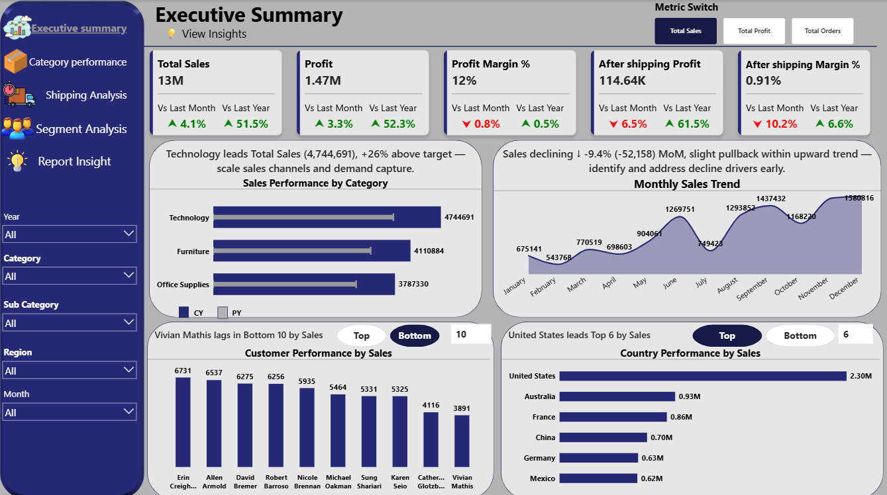
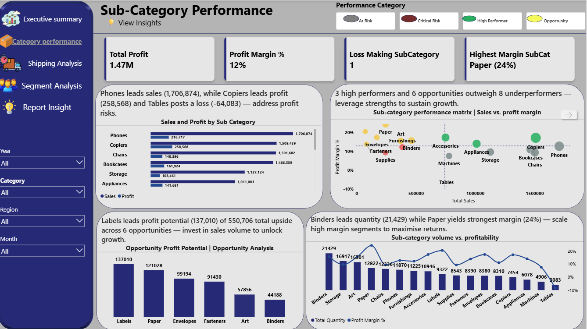
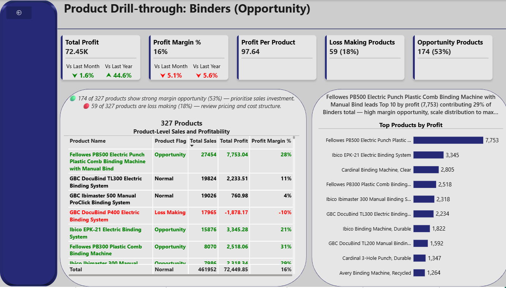
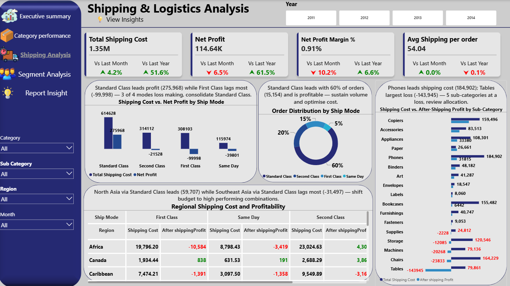
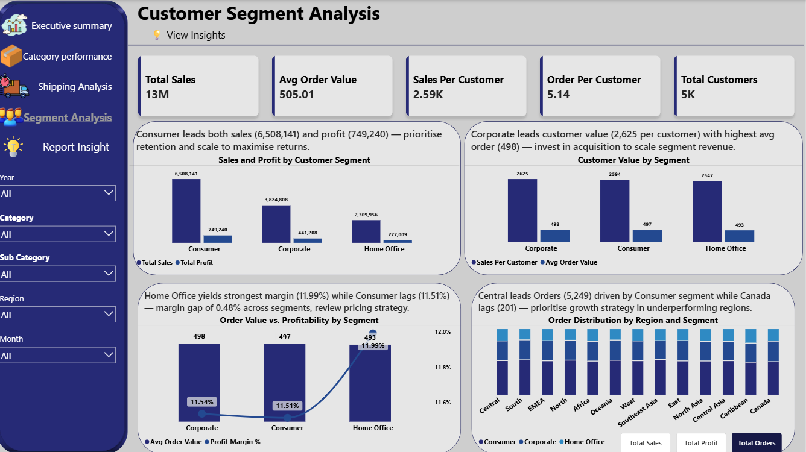
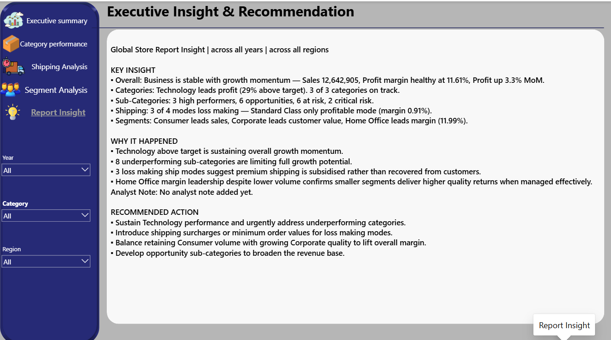

# Executive Sales Performance & Decision Intelligence Dashboard

### Transforming transactional sales data into executive-level performance intelligence and actionable business decisions.

---

## 📊 Project Overview

The **Executive Sales Performance & Decision Intelligence Dashboard** is a six-page interactive Business Intelligence solution developed in Microsoft Power BI using the **Global Superstore dataset covering 2011–2014**.

The project combines performance monitoring, profitability analysis, interactive investigation, DAX-driven classification, contextual insights, and executive recommendations within one connected analytical workflow.

> **What happened → Why it happened → Where the opportunity or risk exists → What action should be taken**

---

## 🎯 Business Problem

Organizations can generate large volumes of sales data across products, customers, regions, categories, and shipping methods while still struggling to understand what is driving profitable performance.

Without an integrated analytical environment, it can be difficult to:

- Identify strong and underperforming products and sub-categories
- Understand the relationship between sales volume and profitability
- Evaluate how shipping costs affect retained profit
- Compare customer segments beyond sales volume
- Identify growth opportunities and business risks
- Translate analysis into practical management actions

---

## 💡 Solution

A six-page Power BI solution was designed around a guided analytical workflow:

**Executive Summary**  
↓  
**Sub-Category Performance**  
↓  
**Product Performance Investigation**  
↓  
**Shipping & Logistics Analysis**  
↓  
**Customer Segment Analysis**  
↓  
**Executive Insights & Recommendations**

The report moves users from high-level performance monitoring to detailed investigation and finally to an executive decision-support layer.

---

## 👥 Intended Users

- Executive Management
- Sales Managers
- Business Owners
- Marketing Teams
- Operations & Logistics Managers

---

## 🛠️ Technologies

**Microsoft Power BI • Power Query • DAX**

---

# 📊 Dashboard Architecture

## 1. Executive Summary

The Executive Summary provides a consolidated view of organizational performance through dynamic KPIs, comparative trends, category analysis, regional performance, and Top/Bottom N analysis.

### Key features

- Dynamic Metric Switch
- Growth target comparison
- Dynamic report headlines
- Interactive slicers
- Top/Bottom N analysis

---

## 2. Sub-Category Performance

The Sub-Category Performance page evaluates business performance using **Total Sales** and **Profit Margin %**.

Each sub-category is dynamically compared with the average Sales and average Profit Margin for the active report context.

### Performance Classification Logic

| Performance Category | Sales vs Avg. Sales | Margin vs Avg. Margin | Business Interpretation |
|---|---|---|---|
| **High Performer** | **≥ Average** | **≥ Average** | Strong sales combined with strong profitability |
| **Opportunity** | **< Average** | **≥ Average** | Healthy profitability with room to grow sales |
| **At Risk** | **≥ Average** | **< Average** | Strong sales volume but weaker profitability |
| **Critical Risk** | **< Average** | **< Average** | Below-average sales and profitability |

The classification responds to the report's analytical context and can change when users apply **Year, Category, Region, or Month** filters.

---

## 3. Product Performance

The Product Performance page provides detailed investigation through **drill-through navigation** from Sub-Category Performance.

It enables users to investigate:

- Product-level Sales
- Product-level Profit
- Profit Margin
- Opportunity products
- Loss-making products
- Product contribution within the selected sub-category

> **Which products are driving the performance of the selected sub-category?**

---

## 4. Shipping & Logistics Analysis

The Shipping & Logistics page evaluates shipping modes, shipping costs, orders, and their effect on profitability.

The analysis identified:

> **3 of 4 shipping modes were loss-making, while Standard Class was the only profitable mode in the overall reporting context.**

The report also distinguishes between:

- **Profit Margin**
- **After Shipping Profit**
- **After Shipping Margin**

This helps reveal how shipping costs can significantly reduce the profitability retained by the business.

---

## 5. Customer Segment Analysis

The Customer Segment page evaluates sales, profit, customer value, order value, customer count, margin, and regional segment performance.

### Key findings

- **Consumer** → Leads sales
- **Corporate** → Leads customer value
- **Home Office** → Leads margin at **11.99%**

The analysis shows why customer performance should be evaluated across multiple dimensions rather than sales volume alone.

---

## 6. Executive Insights & Recommendations

The final page consolidates the major findings from the report into an overall executive interpretation.

Each of the first five dashboards also contains its own **Insight View**, accessible through bookmarks. These page-level views explain the specific dashboard findings, while the sixth page provides the overall business perspective.

The report connects:

**Performance → Investigation → Interpretation → Recommendation**

---

# ⚙️ Key Interactive & Technical Features

### Dynamic Metric Switch

A DAX-driven metric switching mechanism allows users to change the analytical focus between measures such as **Sales, Profit, and Orders**.

### Dynamic Report Headlines

DAX-driven headlines respond to the current report context and selected filters, providing business context instead of relying only on static chart titles.

### Dynamic Sub-Category Classification

The four performance states shown above are implemented with DAX using average Sales and average Profit Margin benchmarks. Because the benchmarks respect the active report context, classifications can change with Year, Category, Region, and Month selections.

### Bookmark-Driven Insight Views

Each of the first five dashboards includes a dedicated Insight View accessible through bookmarks, keeping the main analytical canvas focused while providing contextual interpretation and recommendations.

### Drill-Through Navigation

Users can move from **Sub-Category → Product** without losing the analytical context of the selected performance area.

### Field Parameters

Field parameters provide additional flexibility by allowing supported visuals to dynamically change the analytical dimension or metric being evaluated.

### Interactive Tooltips

Context-sensitive tooltips provide additional information without requiring users to leave the current analytical view.

### Top/Bottom N Analysis

Interactive Top/Bottom N analysis identifies leading and underperforming products, customers, regions, and sub-categories.

---

# 🔍 Key Business Findings

### Overall Performance

Across the overall reporting context:

- **Total Sales:** $12.64M
- **Profit Margin:** 11.61%
- **After Shipping Profit:** $114.64K
- **After Shipping Margin:** 0.91%
- **Month-over-Month Profit Growth:** 3.3%

The results show positive business momentum at the reported-profit level, while the much lower After Shipping Margin highlights the significant effect of shipping costs on retained profitability.

### Category Performance

**Technology** emerged as the strongest category and performed above the defined growth benchmark. All three categories were identified as being on track.

### Sub-Category Performance

The dynamic classification identified:

- **3 High Performers**
- **6 Opportunities**
- **6 At Risk**
- **2 Critical Risk**

### Shipping Performance

**3 of 4 shipping modes were loss-making**, making shipping cost recovery a major area for management attention.

### Customer Segment Performance

**Consumer** leads sales, **Corporate** leads customer value, and **Home Office** leads margin at **11.99%**.

---

# 💡 Why These Findings Matter

The analysis demonstrates why business performance should not be evaluated through a single metric.

For example:

> **Consumer leads sales, while Home Office leads margin.**

A strategy focused only on sales volume could therefore overlook opportunities to improve profitability.

Similarly:

> **Standard Class is the only profitable shipping mode.**

Increasing sales without addressing shipping economics may not produce a proportional improvement in retained profitability.

The dashboard therefore moves the analysis from:

**"What is selling?"**

to:

**"What is actually creating profitable business performance?"**

---

# 🚀 Executive Recommendations

### 1. Sustain Technology Performance

Continue supporting Technology while identifying successful practices that could be applied to weaker areas.

### 2. Address At Risk and Critical Risk Sub-Categories

Investigate pricing, discounting, product mix, demand, and cost structure to identify the drivers of weaker performance.

### 3. Improve Shipping Cost Recovery

Review loss-making shipping modes and consider approaches such as shipping surcharges, minimum order values, or revised shipping pricing.

### 4. Balance Consumer Volume with Corporate Value

Retain Consumer as the primary sales engine while developing Corporate opportunities to strengthen customer value and overall margin quality.

### 5. Develop Opportunity Sub-Categories

Target sub-categories with healthy margins but below-average sales through focused sales, marketing, and product strategies.

---

# 📈 Business Value

The dashboard provides management with a centralized decision-support environment for:

- Monitoring business performance
- Identifying profitability drivers
- Detecting business risks
- Investigating product performance
- Evaluating shipping profitability
- Understanding customer segment quality
- Identifying growth opportunities
- Translating analysis into actionable decisions

The solution moves beyond conventional KPI reporting by connecting:

**Performance Measurement → Investigation → Interpretation → Recommendation**

---

# 📁 Repository Structure

global-superstore-decision-intelligence/  
│  
├── README.md  
├── Executive-Sales-Decision-Intelligence.pbix  
│  
├── assets/  
│   ├── 01-executive-summary.png  
│   ├── 02-sub-category-performance.png  
│   ├── 03-product-performance.png  
│   ├── 04-shipping-logistics.png  
│   ├── 05-customer-segment.png  
│   └── 06-executive-insight.png  
│  
├── data/  
├── documentation/  
└── features/

---

# 📚 Dataset

**Global Superstore | 2011–2014**

The dataset contains transactional information covering sales, products, customers, regions, shipping methods, and profitability.

---

# 👩‍💻 Author

## Miracle Ogar

**Data Analyst | Business Intelligence | Data Analytics**

GitHub: **@miracleogar**

### Project Focus

**Business Intelligence • Data Analytics • Power BI • DAX • Decision Intelligence**
